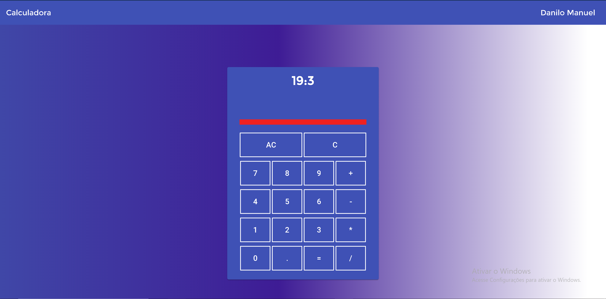

# Calculadora feita em Angular

O projeto foi desenvolvido em typescript

## Ferramentas utilizadas

*  Material design
*  Angular(typescript)
*  CSS
*  HTML

## Obervação

O projeto está sem o npm modules, caso deseja baixar aconselha-se a dar um npm install

